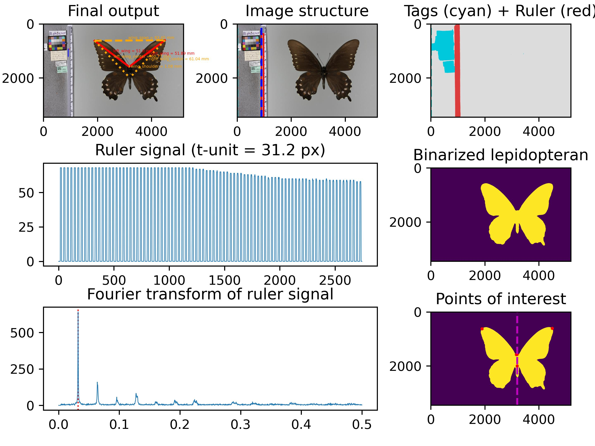
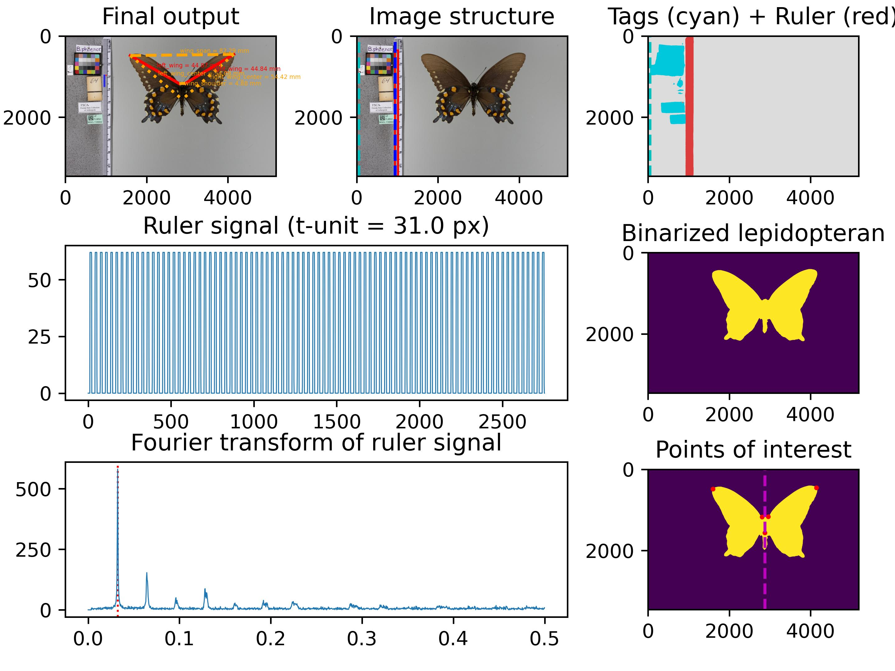
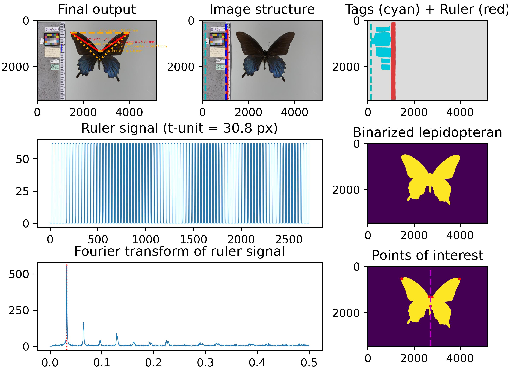
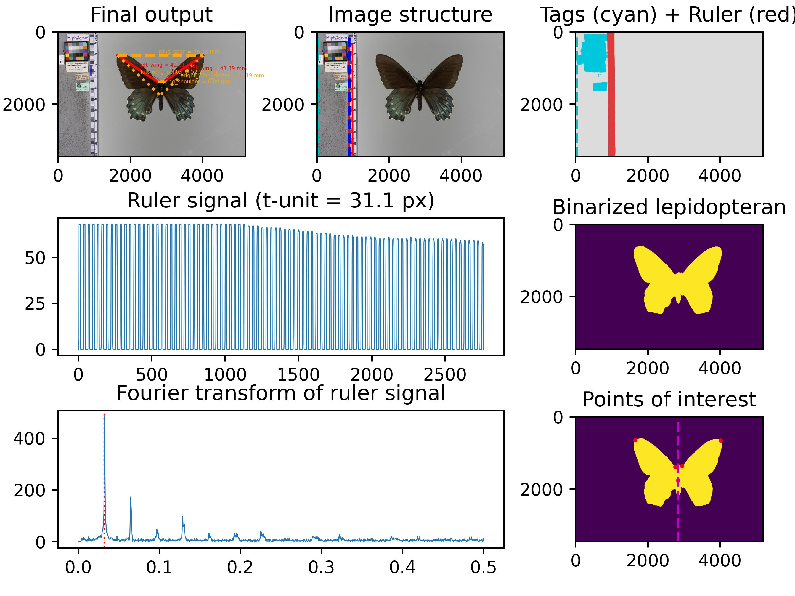
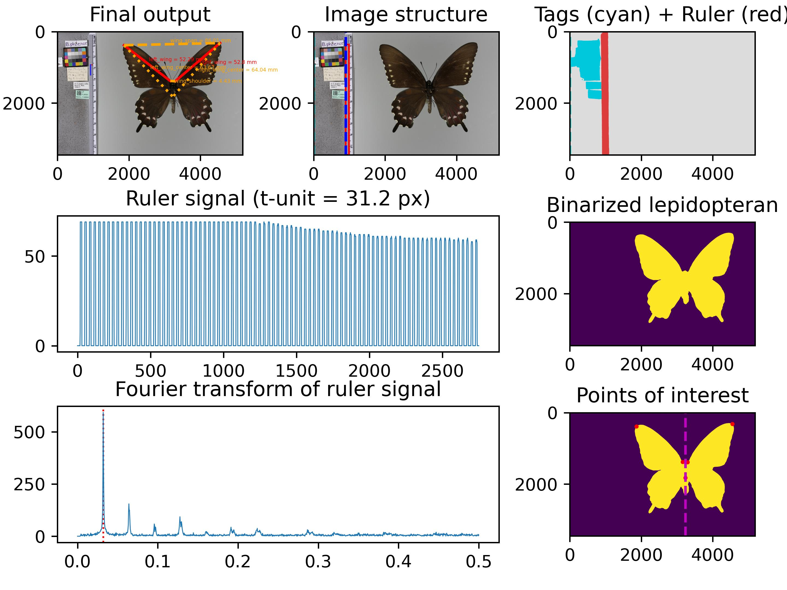
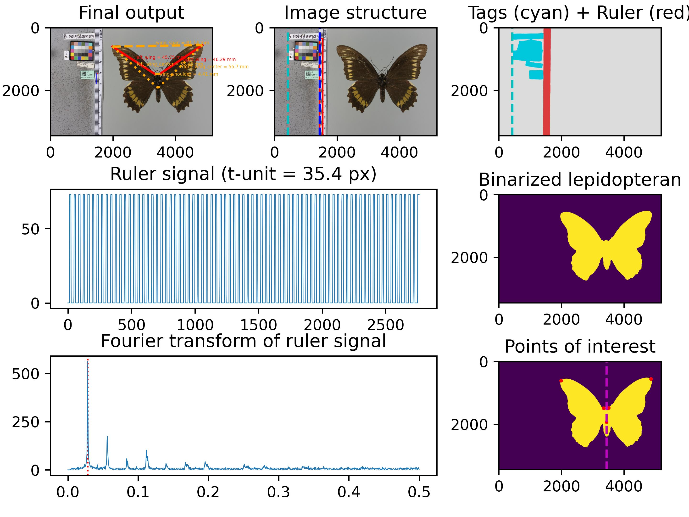
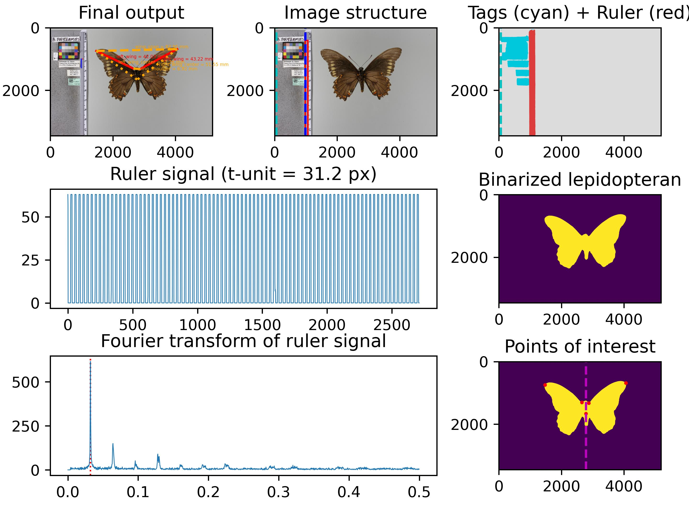
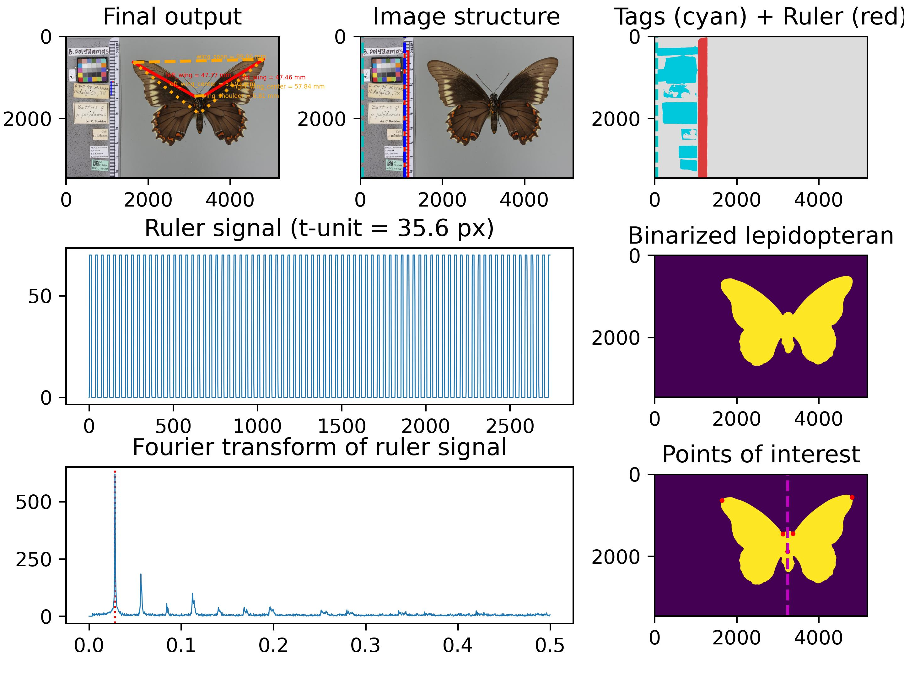
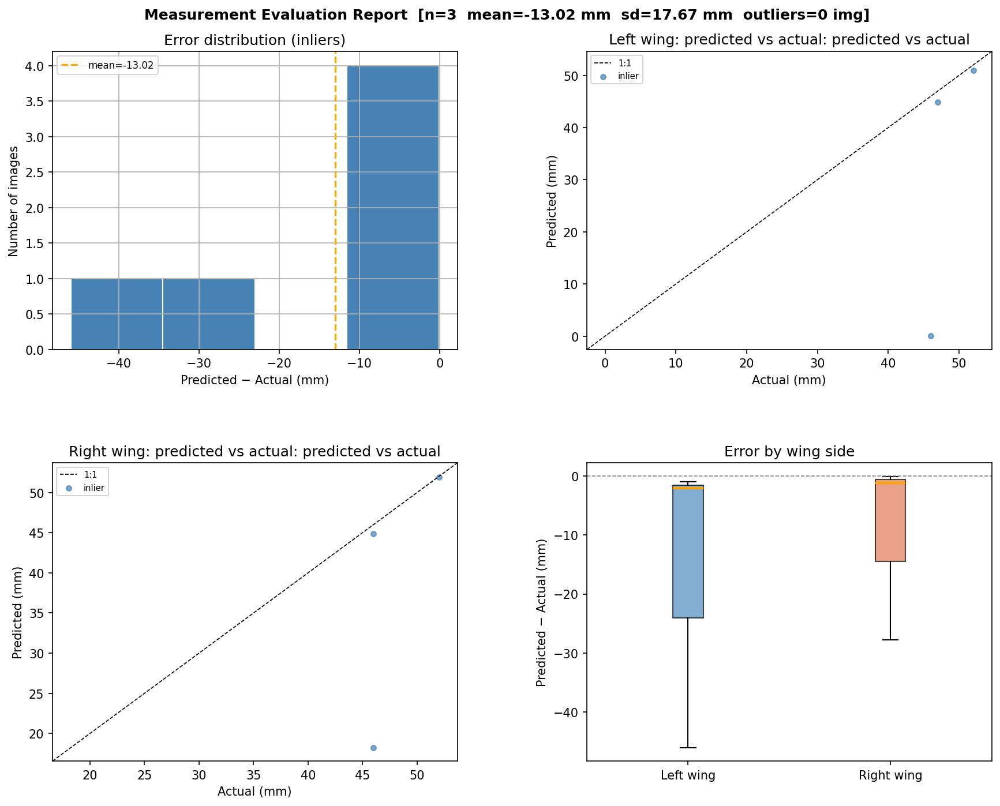
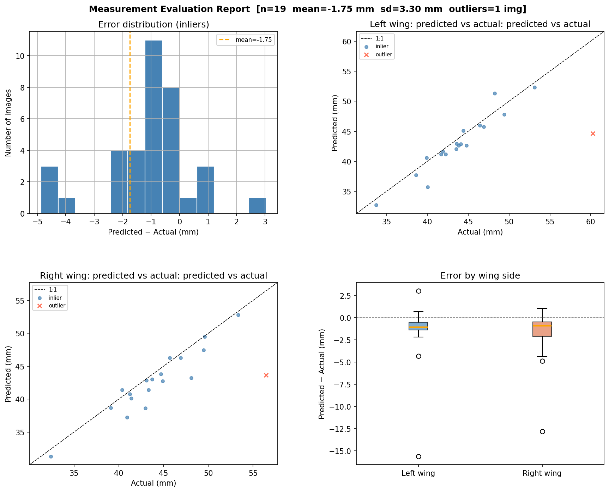

# LepMuse

LepMuse measures *Battus* butterfly specimens from UF Museum image batches. It is a modular rewrite of [Mothra](https://github.com/machine-shop/mothra) with a cleaner pipeline, dataclass-driven configuration, and a pluggable segmentation backend — the current implementation uses UNet (fastai 2.8); SAM2 can be added later by implementing the same `Segmenter` protocol used by [`segmentation/unet/infer.py`](segmentation/unet/infer.py).

> Collaboration between the Chaturvedi Lab at Tulane EEB and Rahul Vishwakarma at Hitachi America Ltd.

**Pipeline**: CVAT Vision Dataset → UNet Segmentation Model → T-space Fourier Measurement

---

## Tasks

- [x] Curate the Battus100 dataset — image-level segmentation masks and manual measurement ground truth
- [x] Refactor Mothra into modular LepMuse pipeline with dataclass configs and segmenter protocol
- [x] Upgrade segmentation stack to fastai 2.8.7 / fastcore 1.12.46 / fasttransform 0.0.2
- [x] Re-train UNet segmentation model on Battus100 — ResNet18, 50 epochs, 800×1200 — see [MODEL.md](MODEL.md)
- [x] Run measurement pipeline on validation images — [(A.) Evaluate measurement pipeline](#a-evaluate-measurement-pipeline)
- [x] Compare predicted measurements to manual ground truth — [(B.) Compare predictions to manual labels](#b-compare-predictions-to-manual-labels)
- [x] Evaluate UNet segmentation masks on held-out images — [(C.) Evaluate segmentation model](#c-evaluate-segmentation-model)
- [ ] Run the full pipeline on all UF Museum specimens
- [ ] Spot check results on random images for verification

---

## Repository Layout

```
lepmuse/              Flat source package: inputs, pipeline, config, results, evaluation
segmentation/unet/    UNet training, inference, segmentation evaluation
datasets/battus10/    10-image smoke-test dataset with train/val splits and manual labels
datasets/battus100/   100-image primary dataset with train/val splits and manual labels
datasets/uf_museum_battus/   UF Museum Battus metadata manifest and label preparation
configs/              JSON configs for training, evaluation, inference, and result comparison
```

---

## Environment Setup

Python 3.10 via Miniconda:

```bash
conda env remove -n lepmuse
conda create -n lepmuse python=3.10
conda activate lepmuse
```

CUDA variables (adjust to your CUDA installation):

```bash
export CUDA_HOME="/usr/local/cuda-11.8"
export PATH=$CUDA_HOME/bin:$PATH
export LD_LIBRARY_PATH=$CUDA_HOME/lib64:$LD_LIBRARY_PATH
```

Clone and install:

```bash
git clone https://github.com/karmarv/lepmuse.git && cd lepmuse
pip install -r requirements.txt
```

Download the pre-trained model weights:

```bash
mkdir -p segmentation/unet/models
wget https://github.com/karmarv/mothra/releases/download/v0.2/battus100_segm_c4_resnet18_b8_e50_s1200x800.pkl \
  -P segmentation/unet/models/
```

Verify CUDA and key package versions:

```bash
python -c "
import torch, fastai, fastcore, fasttransform
print('torch        ', torch.__version__, '  cuda:', torch.cuda.is_available())
print('fastai       ', fastai.__version__)
print('fastcore     ', fastcore.__version__)
print('fasttransform', fasttransform.__version__)
"
```

> **fastai 2.8+ note** — Models exported with fastai ≤ 2.7 cannot be loaded under fastai 2.8+. If you have an older `.pkl`, retrain using `python -m segmentation.unet.train --config configs/unet_train_battus100.json`. See [MODEL.md](MODEL.md) for full training instructions.

---

## (0.) Train UNet Segmentation Model

Config: [`configs/unet_train_battus100.json`](configs/unet_train_battus100.json)

```bash
python -m segmentation.unet.train --config configs/unet_train_battus100.json
```

All run artifacts are written to a timestamped folder under `runs/`:

```
runs/<timestamp>_resnet18_b8_e50_s800x1200/
  train.log                  full stdout + stderr transcript
  history.csv                per-epoch train/val metrics
  best_ckpt.pth              best checkpoint (by acc_camvid)
  <model_name>.pkl           fastai exported model for inference
  events.out.tfevents.*      TensorBoard event file
```

Monitor training with TensorBoard:

```bash
python -m tensorboard.main --logdir runs
```

Key config fields in `unet_train_battus100.json`:

| Field | Default | Description |
|---|---|---|
| `train_data_path` | `datasets/battus100/training_images` | Labelled image folder |
| `architecture` | `resnet18` | ResNet encoder variant |
| `epochs` | `50` | Total training epochs |
| `batch_size` | `8` | Images per batch |
| `image_height` / `image_width` | `800` / `1200` | Resize target |
| `checkpoint_metric` | `acc_camvid` | Metric for SaveModelCallback |
| `early_stopping_patience` | `null` | Set to an integer to enable early stopping |
| `aug_min_zoom` / `aug_max_zoom` | `0.75` / `1.35` | Zoom range for position invariance |
| `aug_max_rotate` | `90.0` | Max random rotation (degrees) |
| `aug_random_erasing` | `true` | Random erasing augmentation |

For a full description of the augmentation strategy and the SAM2 plug-in guide see [MODEL.md](MODEL.md).

---

## (A.) Evaluate Measurement Pipeline

The pipeline writes all stdout/stderr to `pipeline.log` in the output folder automatically. When `eval_config` is set in the pipeline config, measurement evaluation runs immediately after inference completes.

### Battus10 — smoke test (3 images)

Config: [`configs/pipeline_battus10_val_unet.json`](configs/pipeline_battus10_val_unet.json)  
Eval config: [`configs/results_eval_battus10.json`](configs/results_eval_battus10.json)

```bash
time python -m lepmuse.cli \
  --config configs/pipeline_battus10_val_unet.json \
  -pp -ar
```

Outputs written to `datasets/battus10/results/val_images/`:
- `results.csv` — per-image measurements
- `pipeline.log` — full run transcript
- `*.JPG` — detailed per-image diagnostic plots
- `../result_plot.png` — measurement evaluation report (auto-generated)
- `../comparison.csv` — predicted vs actual per image
- `../outliers.csv` — images flagged as outliers

Sample output:

```log
Image 1/3 : IMG_3870.JPG
Processing UNet segmentation...
Estimated ruler t-unit space in pixels - 31.27
Measurements:
* left_wing: 50.72 mm
* right_wing: 50.31 mm
* left_wing_center: 60.55 mm
* right_wing_center: 60.57 mm
* wing_span: 82.88 mm
* wing_shoulder: 3.2 mm

Image 2/3 : IMG_4541.JPG
Processing UNet segmentation...
Estimated ruler t-unit space in pixels - 31.06
Measurements:
* left_wing: 45.17 mm
* right_wing: 44.75 mm
* left_wing_center: 53.6 mm
* right_wing_center: 54.01 mm
* wing_span: 81.7 mm
* wing_shoulder: 4.71 mm
```

| | IMG_3870.JPG | IMG_4541.JPG |
|---|---|---|
| Pipeline output |  |  |

### Battus100 — full validation run (20 images)

Config: [`configs/pipeline_battus100_val_unet.json`](configs/pipeline_battus100_val_unet.json)  
Eval config: [`configs/results_eval_battus100.json`](configs/results_eval_battus100.json)

```bash
time python -m lepmuse.cli \
  --config configs/pipeline_battus100_val_unet.json \
  -pp -ar
```

Outputs written to `datasets/battus100/results/val_images/`:
- `results.csv` — per-image measurements
- `pipeline.log` — full run transcript
- `*.JPG` — detailed per-image diagnostic plots
- `../result_plot.png` — measurement evaluation report (auto-generated)
- `../comparison.csv` — predicted vs actual per image
- `../outliers.csv` — images flagged as outliers

Full run log at [`datasets/battus100/results/val_images/pipeline.log`](datasets/battus100/results/val_images/pipeline.log). Sample output images:

| IMG_0114.JPG | IMG_1759.JPG | IMG_3872.JPG |
|---|---|---|
|  |  |  |
|  |  |  |

### UF Museum batch run

Config: [`configs/uf_museum_manifest.json`](configs/uf_museum_manifest.json) · [`configs/pipeline_uf_museum_unet.json`](configs/pipeline_uf_museum_unet.json)

- **Step 1**: generate image manifest from metadata
    ```bash
    python -m datasets.uf_museum_battus.metadata --config configs/uf_museum_manifest.json
    ```
    - Override individual fields if your images live elsewhere:
        ```bash
        python -m datasets.uf_museum_battus.metadata \
        --config configs/uf_museum_manifest.json \
        --images-root /path/to/UF_museum_data_2023 \
        --output-manifest-csv datasets/uf_museum_battus/metadata/eval_image_manifest.csv \
        --output-paths-csv    datasets/uf_museum_battus/metadata/eval_image_paths.csv \
        --output-missing-csv  datasets/uf_museum_battus/metadata/eval_image_missing.csv
        ```
    - Outputs written to `datasets/uf_museum_battus/metadata/`:
        - `eval_image_manifest.csv` — image paths with specimen metadata (used as pipeline input)
        - `eval_image_paths.csv` — flat list of image paths
        - `eval_image_missing.csv` — rows from the spreadsheet where images were not found on disk
- **Step 2**: run measurement pipeline
    ```bash
    python -m lepmuse.cli --config configs/pipeline_uf_museum_unet.json -ar
    ```

Outputs written to `datasets/uf_museum_battus/results/`:
- `results.csv` — per-specimen measurements
- `images/pipeline.log` — full run transcript

Sample specimen from the UF Museum dataset:


---

## (B.) Compare Predictions to Manual Labels

Evaluation can be run standalone against any results CSV. When `eval_config` is set in a pipeline config it also runs automatically at the end of the pipeline.

### Battus10

Config: [`configs/results_eval_battus10.json`](configs/results_eval_battus10.json)

```bash
python -m lepmuse.evaluate --config configs/results_eval_battus10.json
```

Override individual fields from the CLI if needed:

```bash
python -m lepmuse.evaluate \
  --config configs/results_eval_battus10.json \
  --predicted datasets/battus10/results/val_images/results.csv \
  --output-plot datasets/battus10/results/result_plot.png \
  --output-comparison-csv datasets/battus10/results/comparison.csv \
  --output-outliers-csv datasets/battus10/results/outliers.csv
```



### Battus100

Config: [`configs/results_eval_battus100.json`](configs/results_eval_battus100.json)

```bash
python -m lepmuse.evaluate --config configs/results_eval_battus100.json
```

Override individual fields from the CLI if needed:

```bash
python -m lepmuse.evaluate \
  --config configs/results_eval_battus100.json \
  --predicted datasets/battus100/results/val_images/results.csv \
  --output-plot datasets/battus100/results/result_plot.png \
  --output-comparison-csv datasets/battus100/results/comparison.csv \
  --output-outliers-csv datasets/battus100/results/outliers.csv \
  -sd 2.0
```



The single outlier image is `IMG_2036.JPG` (left diff −14.97 mm, right diff −13.47 mm), likely caused by an unusual specimen pose affecting landmark detection.

---

## (C.) Evaluate Segmentation Model

Segmentation mask accuracy on the Battus100 held-out validation set (20 images).

Config: [`configs/unet_eval_battus100.json`](configs/unet_eval_battus100.json)

```bash
python -m segmentation.unet.evaluate --config configs/unet_eval_battus100.json
```

Override individual fields from the CLI if needed:

```bash
python -m segmentation.unet.evaluate \
  --config configs/unet_eval_battus100.json \
  --weights runs/20260510_193738_resnet18_b2_e50_s800x1200/battus100_segm_c4_resnet18_b2_e50_s1200x800.pkl \
  --image-dir datasets/battus100/val_images/images \
  --mask-dir datasets/battus100/val_images/labels \
  --output-csv datasets/battus100/results/segmentation_eval.csv
```

```log
IMG_2895.JPG   ok    0.9691
IMG_3870.JPG   ok    0.9921
IMG_4541.JPG   ok    0.9904
IMG_0114.JPG   ok    0.9878
IMG_1759.JPG   ok    0.9863
IMG_2036.JPG   ok    0.9712
IMG_2119.JPG   ok    0.9845
IMG_2338.JPG   ok    0.9891
...
```

Results written to [`datasets/battus100/results/segmentation_eval.csv`](datasets/battus100/results/segmentation_eval.csv). The metric reported is foreground pixel accuracy (`acc_camvid`) — the fraction of non-background pixels correctly classified across the four segmentation classes: `background`, `lepidopteran`, `tags`, `ruler`.

For a full training run, segmentation evaluation workflow, and the SAM2 plug-in guide see [MODEL.md](MODEL.md).

---

## Output Columns

Measurement CSVs follow the original Mothra column contract plus operational fields:

| Column | Description |
|---|---|
| `image_id` | Filename |
| `left_wing (mm)` | Left forewing tip to inner margin |
| `right_wing (mm)` | Right forewing tip to inner margin |
| `left_wing_center (mm)` | Left wing tip to body center |
| `right_wing_center (mm)` | Right wing tip to body center |
| `wing_span (mm)` | Full wingspan tip-to-tip |
| `wing_shoulder (mm)` | Inner margin width |
| `image_path` | Full input path |
| `view` | Dorsal / ventral (from manifest) |
| `specimen_id` | Voucher or specimen ID (from manifest) |
| `stage` | Pipeline stop stage: `binarization` · `ruler_detection` · `measurements` |
| `segmenter` | Backend used: `unet` |
| `pixels_per_mm` | Calibrated ruler scale |
| `status` | `ok` · `invalid` · `failed` |
| `error` | Error message when `status != ok` |
